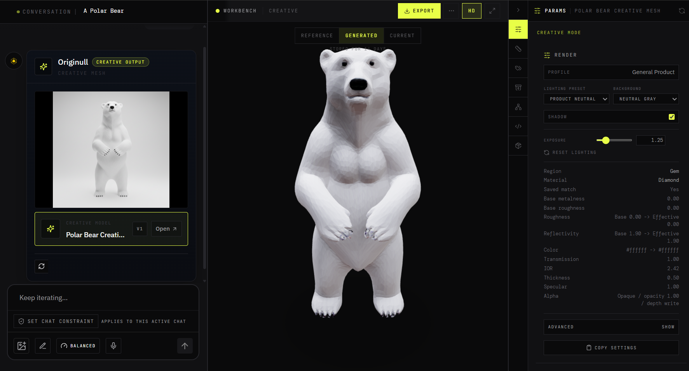
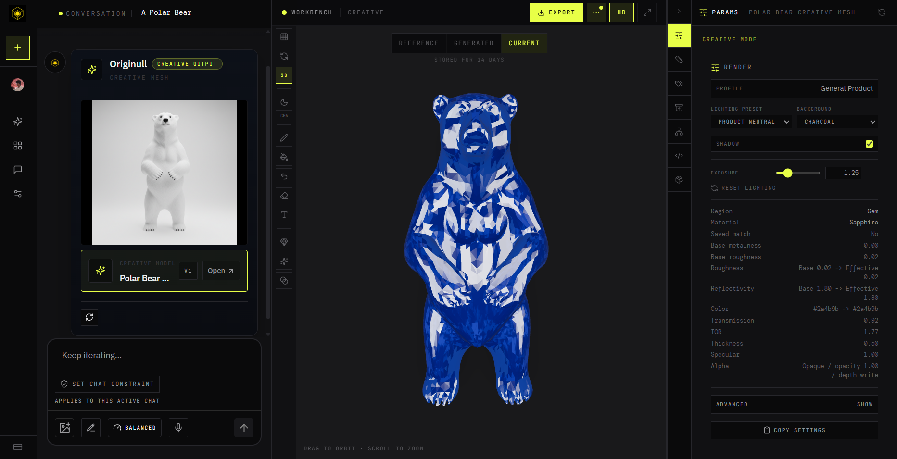
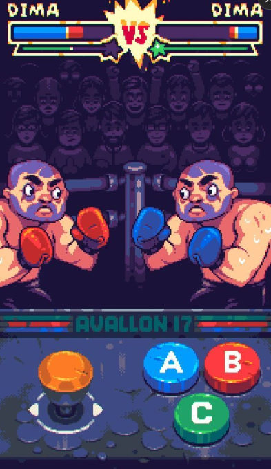
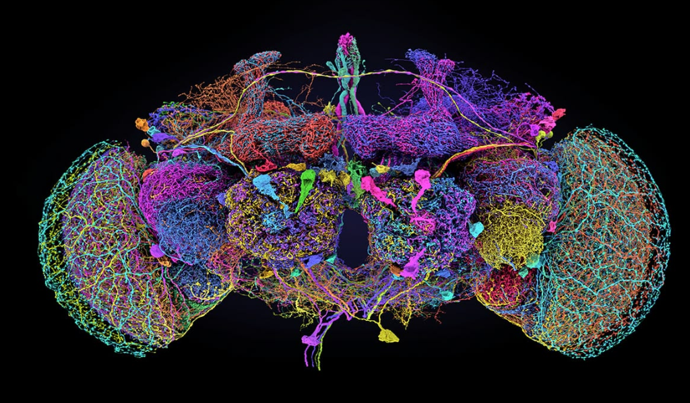
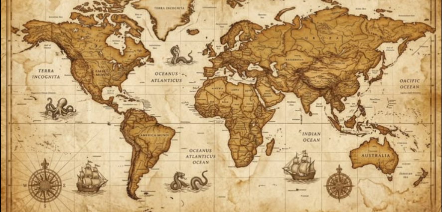
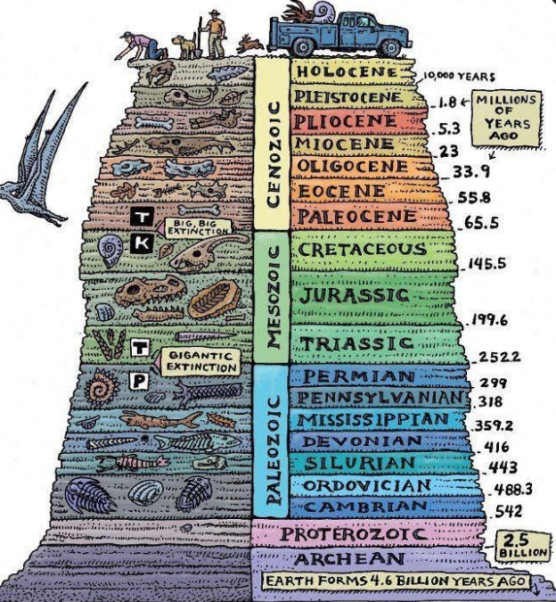
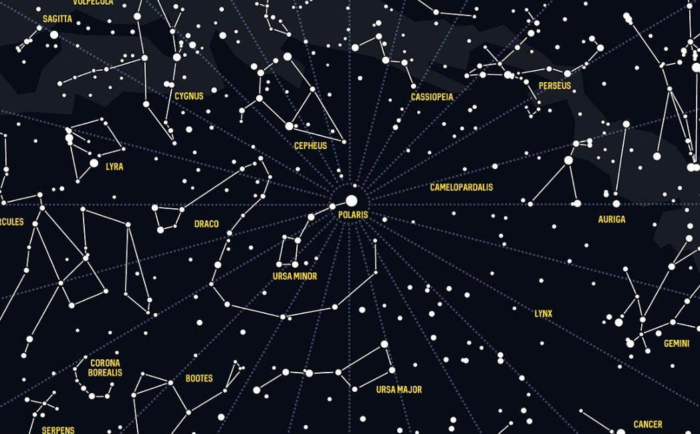
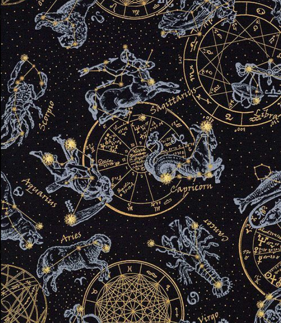
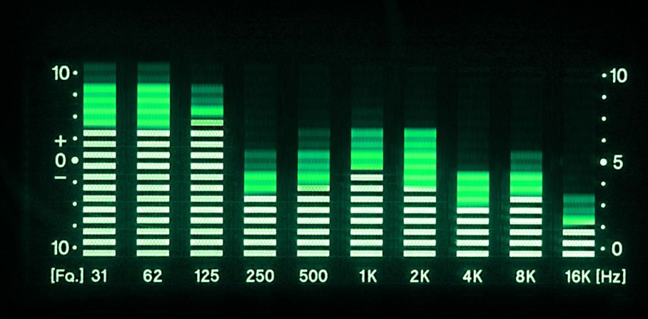
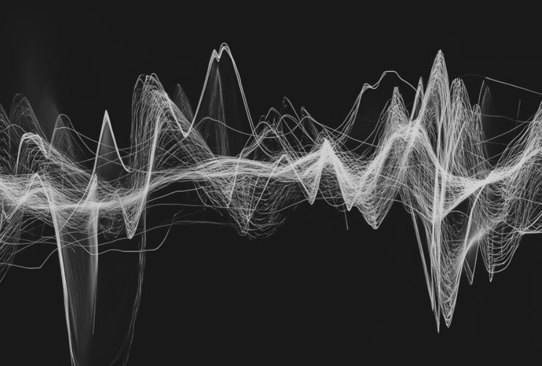

### Founding Engineer / Full-Stack Engineer · Bengaluru, India

---

## about me

I build products end to end: from ambiguous requirements and UX through frontend, backend, AI workflows, auth/security, billing, observability, and production deployment. Most projects here start the same way: a question I couldn't leave alone that turned into something real enough to run, break, and keep pushing on.

- 🚀 Co-founder of **[Originull](https://originull.com)**: an AI platform that turns prompts/images into checkable, editable, versioned 3D. AI is one part of the work; the larger signal is full product ownership
- 🧠 Currently obsessed with whether a *real biological wiring diagram* (not a hand-designed network) can drive believable game AI. See **Flyweight** below
- 🎓 CS undergrad, Dayananda Sagar University (2026) · Network School, Singapore & Malaysia
- 📎 Every number on my [portfolio](https://mukndd.com) ships with a source and a verified flag: nothing renders without both. Same standard applies here

---

## what i'm building right now

**[Originull](https://originull.com)**: a browser workspace that turns product images, prompts, and existing 3D assets into customizable, web-ready 3D. The generation step is an LLM writing *parametric geometry code*, checked by an automated "Functional Critic" before it's ever shown as final, not a diffusion model guessing a mesh. Outbound LLM calls are standardized through a single gateway (OpenRouter) rather than direct provider clients, which keeps routing, cost review, and fallbacks easier to reason about. Full-stack ownership: product direction, the React/TypeScript/Three.js workspace, Supabase-backed auth/storage/billing, and the async generation pipeline (jobs, retries, webhooks, fallback handling). 717 of the production repo's 723 commits are mine.

  
  

---

## selected projects

<table>
<tr>
<td width="33%" valign="top">

**🧬 [Flyweight](https://github.com/mukndd/flyweight)**
A 2D fighting game where one controller isn't hand-tuned: its wiring comes from the real **FlyWire fruit-fly connectome**, reduced to a fixed, hash-verified 1,536-neuron / 170,489-edge subgraph. Only the artificial sensory encoder and motor readout are trained (via Cross-Entropy Method); the biological graph never learns. First full training run: **0% → 100%** held-out win rate, reported alongside its own honestly-flagged caveats about brittle convergence.
`Python` `FastAPI` `WebSockets` `NumPy/SciPy` `React` `Three.js`

 

</td>
<td width="33%" valign="top">

**🌍 [Findin](https://findin.world)**
A browser game combining geography with deep time: read the evidence, guess **where** an animal lived and **when**, with real paleogeographic coastlines for extinct species instead of pretending ancient life belongs on today's map. Built the full content pipeline (GBIF, Paleobiology Database, GPlates-derived reconstructions) with quality gates; 60 species manually verified for launch.
`Next.js` `TypeScript` `Supabase` `PostHog`

 

</td>
<td width="33%" valign="top">

**✨ [Asterisms](https://asterisms.space)**
A daily constellation-learning game on a *real* astronomy catalogue: 88 IAU constellations, 74 Western asterisms, 9,036 real cataloged stars, projected with real gnomonic RA/Dec math, not decorative particle stars. Neon Postgres handles only puzzle scheduling and leaderboards, so a DB outage degrades the leaderboard, never the game. Sole builder: data pipeline, gameplay, frontend.
`Next.js` `Neon` `Drizzle` `PostHog` · [case study](https://github.com/mukndd/asterisms-case-study)

 

</td>
</tr>
</table>

## more builds

**✋ [Gesture-Based System Equalizer](https://github.com/mukndd/gesture-based-eq)**: a webcam, your hand, and a 10-band system-wide audio EQ: no mouse, no sliders. Finger-count selects the band, a pinch adjusts it with exponential smoothing to kill jitter, an L-shape gesture locks it, and a two-hand gesture resets.
`Python` `OpenCV` `MediaPipe` `PyQt5`

  
  

More (CareerBridge, hardware builds) on the [portfolio](https://mukndd.com), where every claim is checked against source.

---

## core stack

Full breakdown per project on the [portfolio](https://mukndd.com).

---

*building whatever catches my fancy.* · reach me at **mukundg1101@gmail.com**

